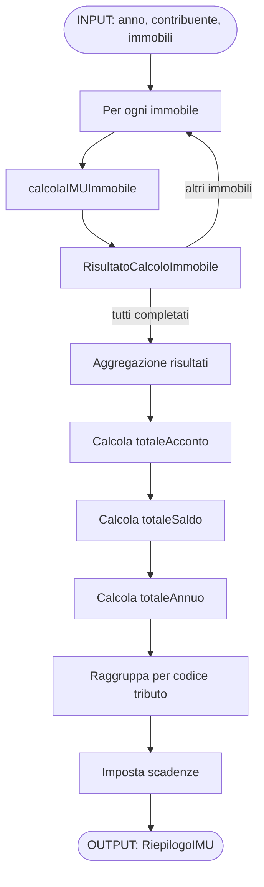
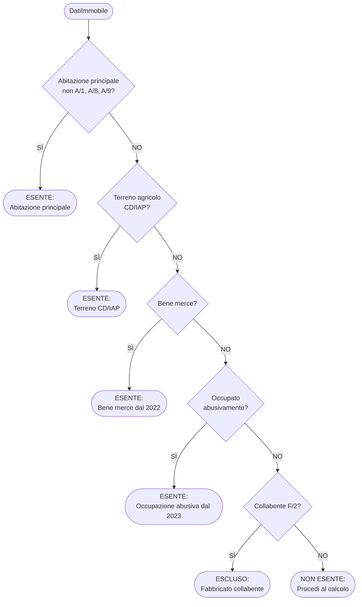
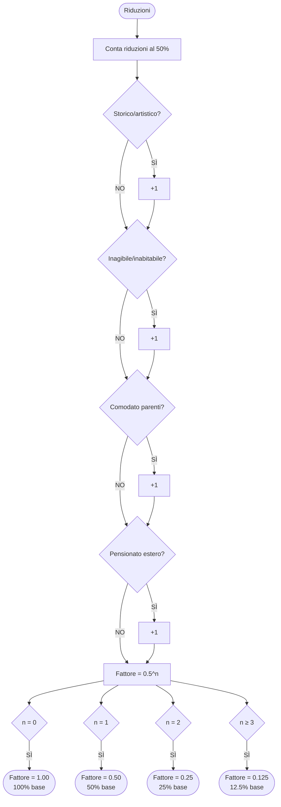
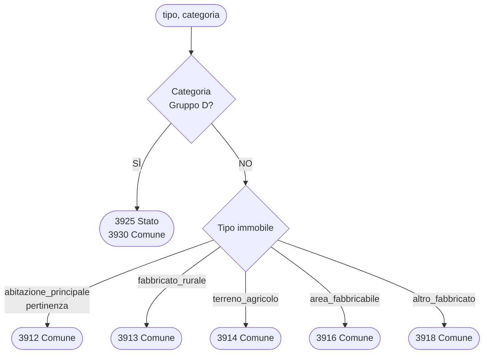

# Diagramma di Flusso - Calcolatore IMU 2025

> Generato: 2025-12-11
> Basato su: `src/utils/calcolo.ts`, `src/types/index.ts`, `src/utils/constants.ts`

---

## 1. Architettura Generale

```
┌─────────────────────────────────────────────────────────────────────────────┐
│                           CALCOLATORE IMU 2025                              │
│                          src/index.ts (entry point)                         │
├─────────────────────────────────────────────────────────────────────────────┤
│                                                                             │
│  ┌─────────────────┐   ┌─────────────────┐   ┌─────────────────────────┐   │
│  │   TYPES         │   │   CONSTANTS     │   │   CALCOLO               │   │
│  │   src/types/    │   │   src/utils/    │   │   src/utils/calcolo.ts  │   │
│  │                 │   │   constants.ts  │   │                         │   │
│  │ • DatiImmobile  │   │                 │   │ • calcolaIMUImmobile()  │   │
│  │ • Riduzioni     │   │ • COEFFICIENTI  │   │ • calcolaRiepilogoIMU() │   │
│  │ • Esenzioni     │   │ • ALIQUOTE_MINISTERO│ │ • verificaEsenzione()   │   │
│  │ • Risultato     │   │ • CODICI_TRIBUTO│   │ • calcolaBase...()      │   │
│  │ • Riepilogo     │   │ • SCADENZE      │   │ • calcolaQuote...()     │   │
│  └─────────────────┘   └─────────────────┘   └─────────────────────────┘   │
│                                                                             │
└─────────────────────────────────────────────────────────────────────────────┘
```

---

## 2. Flusso Principale: `calcolaRiepilogoIMU()`



---

## 3. Flusso Calcolo Singolo Immobile: `calcolaIMUImmobile()`

```mermaid
flowchart TD
    INPUT([DatiImmobile]) --> ESE{verificaEsenzione}

    ESE -->|ESENTE| ESENTE_OUT([Risultato: esente=true\nimuTotale=0])

    ESE -->|NON ESENTE| TIPO{Tipo immobile?}

    TIPO -->|terreno_agricolo| BASE_T[calcolaBaseImponibileTerreno\nRD × 1.25 × 135]
    TIPO -->|area_fabbricabile| BASE_A[calcolaBaseImponibileArea\nValore × %possesso]
    TIPO -->|fabbricato| BASE_F[calcolaBaseImponibileFabbricato\nRendita × 1.05 × Coeff]

    BASE_T --> RID[calcolaFattoreRiduzione]
    BASE_A --> RID
    BASE_F --> RID

    RID --> NETTA[Base netta =\nBase lorda × Fattore]

    NETTA --> ACC[calcolaIMUPeriodo\nAcconto 1° semestre]
    ACC --> ANN[calcolaIMUPeriodo\nIMU annuale]
    ANN --> SALDO[Saldo = max(0, annuale - acconto)]

    SALDO --> ABITP{Abitazione\nprincipale\nA/1, A/8, A/9?}
    ABITP -->|SÌ| DETR[calcolaDetrazione\n€200 × %possesso × mesi/12]
    ABITP -->|NO| GRUPPOD

    DETR --> TOT_DETR[Totale = max(0, totale - detrazione)]
    TOT_DETR --> GRUPPOD

    GRUPPOD{Gruppo D?}
    GRUPPOD -->|SÌ| QUOTE[calcolaQuoteGruppoD\nStato: 0.76%\nComune: eccedenza]
    GRUPPOD -->|NO| TRIBUTO

    QUOTE --> TRIBUTO[getCodiceTributo]
    TRIBUTO --> OUTPUT([RisultatoCalcoloImmobile])
```

---

## 4. Dettaglio: Verifica Esenzione



---

## 5. Dettaglio: Calcolo Fattore Riduzione



---

## 6. Dettaglio: Calcolo IMU Periodo

```mermaid
flowchart TD
    INPUT([base, aliquota, mesi, canoneConc]) --> CHECK{base > 0\ne mesi > 0?}

    CHECK -->|NO| ZERO([IMU = 0])

    CHECK -->|SÌ| CONC{Canone\nconcordato?}
    CONC -->|SÌ| ALQ75[Aliquota effettiva =\naliquota × 0.75]
    CONC -->|NO| ALQ100[Aliquota effettiva =\naliquota]

    ALQ75 --> FORMULA
    ALQ100 --> FORMULA

    FORMULA[IMU = base × (aliquota/100) × (mesi/12)]
    FORMULA --> ROUND[Arrotonda a 2 decimali]
    ROUND --> OUTPUT([IMU periodo])
```

---

## 7. Dettaglio: Quote Gruppo D

```mermaid
flowchart TD
    INPUT([base, aliquota, mesi]) --> STATO[Aliquota Stato =\nmin(aliquota, 0.76)]

    STATO --> QSTATO[Quota Stato =\nbase × (aliqStato/100) × (mesi/12)]

    QSTATO --> COMUNE[Aliquota Comune =\nmax(0, aliquota - 0.76)]

    COMUNE --> QCOMUNE[Quota Comune =\nbase × (aliqComune/100) × (mesi/12)]

    QCOMUNE --> OUTPUT([quotaStato, quotaComune])
```

---

## 8. Codici Tributo F24



---

## 9. Struttura Dati: Input/Output

### Input: `DatiImmobile`

```
┌─────────────────────────────────────────────────────────────────┐
│                        DatiImmobile                             │
├─────────────────────────────────────────────────────────────────┤
│ Identificazione                                                 │
│   • id: string                                                  │
│   • descrizione?: string                                        │
│   • fattispecie_principale: FattispeciePrincipale               │
│   • categoria: CategoriaCatastale                               │
├─────────────────────────────────────────────────────────────────┤
│ Dati Catastali (uno dei tre)                                    │
│   • renditaCatastale?: number     (fabbricati)                  │
│   • redditoDominicale?: number    (terreni)                     │
│   • valoreVenale?: number         (aree fabbricabili)           │
├─────────────────────────────────────────────────────────────────┤
│ Possesso                                                        │
│   • percentualePossesso: 0-100                                  │
│   • mesiPrimoSemestre: 0-6                                      │
│   • mesiSecondoSemestre: 0-6                                    │
├─────────────────────────────────────────────────────────────────┤
│ Aliquote                                                        │
│   • aliquotaAcconto: number       (% es. 0.86)                  │
│   • aliquotaSaldo: number         (% es. 0.86)                  │
├─────────────────────────────────────────────────────────────────┤
│ Riduzioni                                                       │
│   • storicoArtistico: boolean     (-50% base)                   │
│   • inagibileInabitabile: boolean (-50% base)                   │
│   • comodatoParenti: boolean      (-50% base)                   │
│   • canoneCorordato: boolean      (-25% aliquota)               │
│   • pensionatoEstero: boolean     (-50% base)                   │
├─────────────────────────────────────────────────────────────────┤
│ Esenzioni                                                       │
│   • abitazionePrincipale: boolean (non A/1,A/8,A/9)             │
│   • terrenoCdIap: boolean         (CD/IAP)                      │
│   • beneMerce: boolean            (dal 2022)                    │
│   • occupatoAbusivamente: boolean (dal 2023)                    │
│   • collabente: boolean           (F/2)                         │
└─────────────────────────────────────────────────────────────────┘
```

### Output: `RisultatoCalcoloImmobile`

```
┌─────────────────────────────────────────────────────────────────┐
│                   RisultatoCalcoloImmobile                      │
├─────────────────────────────────────────────────────────────────┤
│ Riferimento                                                     │
│   • immobile: DatiImmobile                                      │
├─────────────────────────────────────────────────────────────────┤
│ Calcoli Intermedi                                               │
│   • coefficiente: number          (55-160 o 135 per terreni)    │
│   • baseImponibileLorda: number                                 │
│   • fattoreRiduzione: number      (1, 0.5, 0.25, 0.125)         │
│   • baseImponibileNetta: number                                 │
├─────────────────────────────────────────────────────────────────┤
│ Importi                                                         │
│   • imuAcconto: number            (I rata 16/06)                │
│   • imuSaldo: number              (II rata 16/12)               │
│   • imuTotale: number                                           │
├─────────────────────────────────────────────────────────────────┤
│ Quote Stato/Comune (solo gruppo D)                              │
│   • quotaStato?: number           (0.76%)                       │
│   • quotaComune?: number          (eccedenza)                   │
├─────────────────────────────────────────────────────────────────┤
│ Detrazione (solo abitazione principale lusso)                   │
│   • detrazione?: number           (€200 proporzionata)          │
├─────────────────────────────────────────────────────────────────┤
│ Stato Esenzione                                                 │
│   • esente: boolean                                             │
│   • motivoEsenzione?: string                                    │
├─────────────────────────────────────────────────────────────────┤
│ Codici F24                                                      │
│   • codiceTributoComune: string                                 │
│   • codiceTributoStato?: string   (solo gruppo D)               │
└─────────────────────────────────────────────────────────────────┘
```

### Output Aggregato: `RiepilogoIMU`

```
┌─────────────────────────────────────────────────────────────────┐
│                        RiepilogoIMU                             │
├─────────────────────────────────────────────────────────────────┤
│ Dati Generali                                                   │
│   • anno: number                                                │
│   • contribuente: string                                        │
│   • codiceFiscale?: string                                      │
├─────────────────────────────────────────────────────────────────┤
│ Risultati                                                       │
│   • immobili: RisultatoCalcoloImmobile[]                        │
├─────────────────────────────────────────────────────────────────┤
│ Totali                                                          │
│   • totaleAcconto: number                                       │
│   • totaleSaldo: number                                         │
│   • totaleAnnuo: number                                         │
├─────────────────────────────────────────────────────────────────┤
│ Per Codice Tributo                                              │
│   • totaliPerCodice: Record<string, number>                     │
│     es. { "3912": 150, "3918": 500, "3925": 200 }               │
├─────────────────────────────────────────────────────────────────┤
│ Scadenze                                                        │
│   • scadenzaAcconto: "16/06/YYYY"                               │
│   • scadenzaSaldo: "16/12/YYYY"                                 │
└─────────────────────────────────────────────────────────────────┘
```

---

## 10. Costanti di Sistema

| Costante | Valore | Riferimento |
|----------|--------|-------------|
| RIVALUTAZIONE_RENDITA | 1.05 (5%) | Art. 1, c. 745 |
| RIVALUTAZIONE_TERRENI | 1.25 (25%) | Art. 1, c. 746 |
| COEFFICIENTE_TERRENI | 135 | Art. 1, c. 746 |
| QUOTA_STATO_GRUPPO_D | 0.76% | Art. 1, c. 753 |
| DETRAZIONE_ABITAZIONE_PRINCIPALE | €200 | Art. 1, c. 749 |
| SOGLIA_MINIMA_VERSAMENTO | €12 | Art. 1, c. 759 |

### Coefficienti Moltiplicatori

| Categoria | Coefficiente |
|-----------|--------------|
| A/1-A/9, A/11, C/2, C/6, C/7 | 160 |
| B/1-B/8, C/3-C/5 | 140 |
| A/10, D/5 | 80 |
| D/1-D/4, D/6-D/10 | 65 |
| C/1 | 55 |

---

## 11. Funzionalità Implementate vs Da Implementare

### ✅ Implementate

| Funzionalità | Funzione |
|--------------|----------|
| Calcolo base fabbricati | `calcolaBaseImponibileFabbricato()` |
| Calcolo base terreni | `calcolaBaseImponibileTerreno()` |
| Calcolo base aree | `calcolaBaseImponibileArea()` |
| Riduzioni 50% cumulative | `calcolaFattoreRiduzione()` |
| Riduzione canone concordato 25% | `calcolaIMUPeriodo()` |
| Esenzioni (5 tipi) | `verificaEsenzione()` |
| Detrazione €200 | `calcolaDetrazione()` |
| Quote Stato/Comune gruppo D | `calcolaQuoteGruppoD()` |
| Codici tributo F24 | `getCodiceTributo()` |
| Aggregazione riepilogo | `calcolaRiepilogoIMU()` |

### ⏳ Da Implementare

| Funzionalità | Note |
|--------------|------|
| Coefficienti D non catastati | Tabella DM 14/3/2025 |
| Soggetti passivi avanzati | Trust, leasing, fallimento |
| Immobili assimilati | Cooperative, alloggi sociali |
| Limite pertinenze | Max 3 (una per C/2, C/6, C/7) |
| ENC proporzionale | Uso promiscuo |
| Valori venali comunali | Alert se < valore deliberato |
| Alert dichiarazione | Obbligo dichiarativo |
| IMIS/IMI/ILIA | Imposte regionali sostitutive |

---

*Documento generato automaticamente dall'analisi del codice sorgente*
